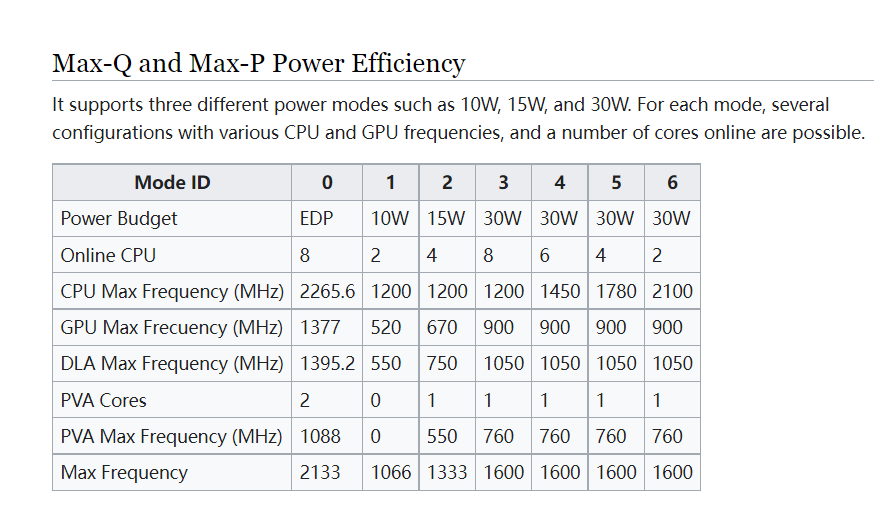
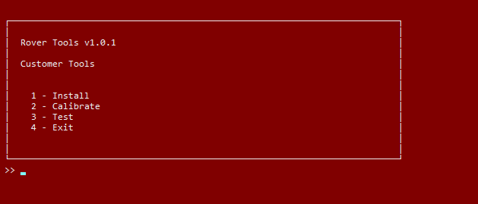
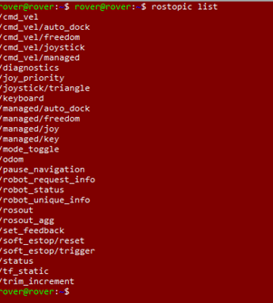
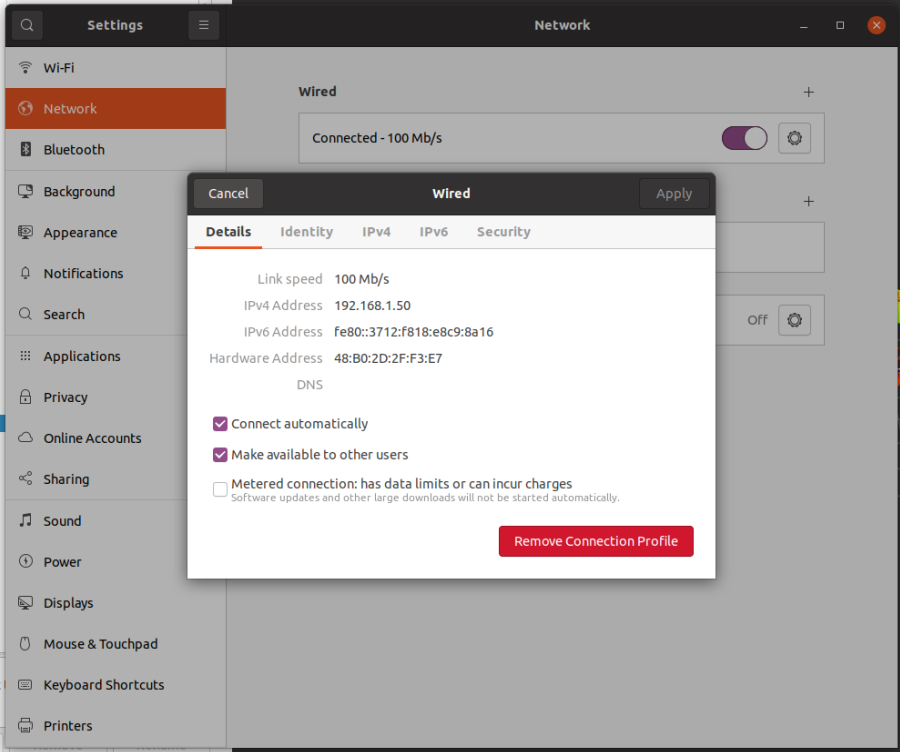
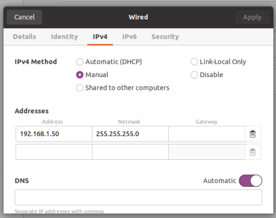
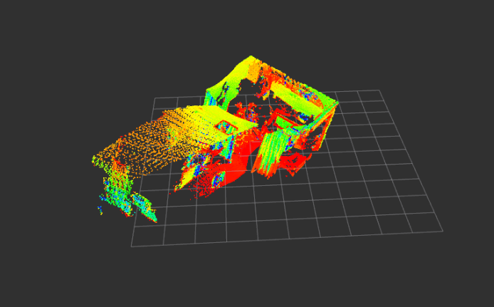
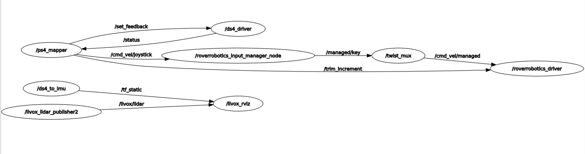
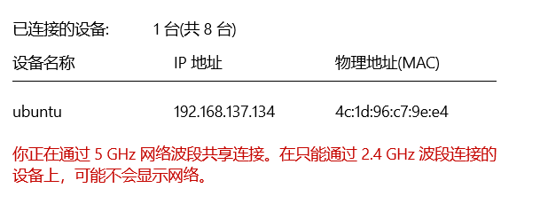

# Robot Setup Procedure


# Device List

- [4WD Rover Pro](https://roverrobotics.com/en-au/products/4wd-rover-pro-variants)

- [Jetson AGX Xavier](https://www.nvidia.com/en-sg/autonomous-machines/embedded-systems/jetson-agx-xavier/)

- D435i Depth Camera
- PS4 Controller

# Jetson AGX Xavier Setup

## Switch to M**aximum Power Mode**

**Check available modes**

```jsx
sudo nvpmodel -q --verbose
```

**Check current mode**

```jsx
sudo nvpmodel -q
```

**Switch to maximum power mode**

```jsx
sudo nvpmodel -m 0
```

**Maximize CPU performance**

```jsx
sudo jetson_clocks
```



## Flash Jetpack 5.1.2 to AGX Xavier

The AGX Xavier I'm utilizing was set up by Rover Robotics before its shipment to CSIRO. It operates on **Ubuntu 18** and comes with ROS Melodic pre-installed, though it's worth noting that **CUDA hasn't been installed**.

Since then, Rover Robotics has transitioned to **ROS Noetic** and **ROS2 Humble** for their codebase. At the moment, the **latest version of JetPack is 5.1.2**, which is tailored for Ubuntu 20.04. In light of these developments and to ensure optimum software compatibility, I've chosen to upgrade the system to **Ubuntu 20.04** and adopt **ROS Noetic**.

AGX Xavier uses onboard eMMC (embedded MultiMediaCard) storage for more durability and faster data access. It is done via **Nividia SDK Manager**.

[NVIDIA SDK Manager](https://developer.nvidia.com/sdk-manager)

1. Setup a Ubuntu 20 system. Running Ubuntu on Win 10 Virtual Machine also works
2. Install SDK Manager (Need sudo access). May need to sign up an Nvidia account
3. Connect the AGX Xavier and the PC to the same network (**Must Do**)
4. Boot AGX Xavier at Recovery Mode and connect it to the PC (Via the USB port near the power button)
5. Now the PC should be able to detect AGX Xavier.
6. Select the correct Jetson Model and the desired Jetpack Version. Don’t select “Host Machine”.
7. Start flashing the image. If Automatic Install fails, try manual. If USB connection fails, try LAN connection.
8. After the image is flashed, the AGX Xavier will boot (the Cuda is still installing).
9. Check the IP address and install the cuda using LAN connection. 
10. After Cuda is installed, reboot and try nvcc -V to verify the installation.

## Install Rover Robotics Package

[Rover Robotics](https://www.notion.so/Rover-Robotics-a21b40f87e7a45e2bc3c8a6b27ab10f8?pvs=21)

### Installation and Setup

Here I installed the ROS1 noetic version. Note that ROS2 Humble Version is also available. 

[https://github.com/RoverRobotics/rover_tools_ros1](https://github.com/RoverRobotics/rover_tools_ros1)

1. git clone the repository at home directory
2. execute the ./start.sh
    
    Here I recommend to install the ROS noetic and relevant package manually. 
    
    [noetic/Installation/Ubuntu - ROS Wiki](http://wiki.ros.org/noetic/Installation/Ubuntu)
    
    Also it is better to execute the lines of ./start.sh one by one to ensure everything is installed.
    
3. If successfully execute the menu_main.py, the manual will show up. Install “pro” model.



For noetic release, it does not have “calibrate”. Also the “Test” doesn’t work since it is based on python2, which is deprecated in noetic.

1. Reboot and check two things
    - Check if the service is up using (The manual has typo error. It is service, not services)
    
    ```xml
    sudo systemctl status roverrobotics.service
    ```
    
    - Check if all the topic is there using
    
    ```xml
    rostopic list
    ```
    
    
    
2. Ususally /odom and /robot_status are missing if you haven’t set up the correct device port. If you check the rqt_graph. You will find the driver node is missing.
    
    ```xml
    rosrun rqt_graph rqt_graph
    ```
    
3. Check the /dev directory and identify the device name of the driver (mine is ttyUSB0)
4. Search for the driver launch file (mine is pro.launch) and change the device port to the correct one.
5. Reboot and now the AGX Xavier and the driver should be communicating.

### Control Chassis

**Option 1: Direct Command**

```xml
rostopic pub -r 1 /cmd_vel geometry_msgs/Twist '{linear: {x: 0.3, y: 0.0, z: 0.0}, angular: {x: 0.0,y: 0.0,z: 0.0}}’
rostopic pub -r 1 /cmd_vel geometry_msgs/Twist '{linear: {x: 0.0, y: 0.0, z: 0.0}, angular: {x: 0.0,y: 0.0,z: 0.0}}’
```

**Option 2: Keyboard**

```xml
sudo apt install ros-noetic-teleop-twist-keyboard
rosrun teleop_twist_keyboard teleop_twist_keyboard.py
```

**Option 3: PS4 Controller**

AGX Xavier has built-in bluetooth. Connect PS4 controller and it immediately works.

## Install Realsense Package

### Install Realsense SDK

Installing realsense package in AGX Xavier is a bit different from other PC. This one should work.

[GitHub - jetsonhacks/installRealSenseSDK: Install the Intel RealSense SDK on the NVIDIA Jetson Development Kits](https://github.com/jetsonhacks/installRealSenseSDK/tree/master)

If there is key missing, add manually.

```xml
sudo apt-key adv --keyserver hkp://keyserver.ubuntu.com:80 --recv-key F6E65AC044F831AC80A06380C8B3A55A6F3EFCDE
```

After Installation, use realsense viewer to check if the camera output is fine.

```xml
realsense-viewer
```

### Install ROS Wrapper

Install the ros1 wrapper. Must build from source to run on native backend so that you have gpu acceleration on frame alignment and other features. If you install using apt-get, it is running on RS-USB backend. It has no CUDA support and aligned frame has super low frame rate.

[GitHub - IntelRealSense/realsense-ros at ros1-legacy](https://github.com/IntelRealSense/realsense-ros/tree/ros1-legacy)

Need to do two extra things to make it work. First install the package mentioned in the guide. Then find the cmakelist.txt, point to the Opencv manually, or the node will die after launching.

run

```jsx
sudo find / -name "OpenCVConfig.cmake”
```

modify the CMAKElist

```jsx
set(OpenCV_DIR "/usr/lib/aarch64-linux-gnu/cmake/opencv4/")
find_package(catkin REQUIRED COMPONENTS
    message_generation
    nav_msgs
    roscpp
    sensor_msgs
    std_msgs
    std_srvs
    nodelet
    cv_bridge
    image_transport
    tf
    ddynamic_reconfigure
    diagnostic_updater
    OpenCV REQUIRED
    )
```

After installing, the camera can be launched by the following. The gyro and accel topics are not launched by default.

```xml
roslaunch realsense2_camera rs_camera.launch enable_gyro:=true enable_accel:=true
```

### Modify the topic name (optional)

In pro.launch, add the following to the driver node. We are publishing our own /odom topic.

```xml
<node ...>
<remap from="odom" to="unused_odom"/>
</node>
```

### **Record Dataset**

Launch with this launch file. Turn off the infrared since we don’t need it.

[](https://github.com/Lu-tju/SLAM_file/blob/main/vins_rs/launch/rs_camera_vins.launch)

Record the data into a rosbag file

```jsx
rosbag record -O my_dataset.bag /camera/imu /camera/color/image_raw /camera/aligned_depth_to_color/image_raw 
```

## Livox Mid 360 livox_ros_driver2

Very Important! This package has its own setup.sh

It is actually **~/catkin_ws/src/ws_livox/devel/setup.sh** not the one in **~/catkin_ws/devel**

```
source ../../devel/setup.sh
roslaunch livox_ros_driver2 [launch file]
```

MID360_config.json

```json
{
  "lidar_summary_info" : {
    "lidar_type": 8
  },
  "MID360": {
    "lidar_net_info" : {
      "cmd_data_port": 56100,
      "push_msg_port": 56200,
      "point_data_port": 56300,
      "imu_data_port": 56400,
      "log_data_port": 56500
    },
    "host_net_info" : {
      "cmd_data_ip" : "192.168.1.50",
      "cmd_data_port": 56101,
      "push_msg_ip": "192.168.1.50",
      "push_msg_port": 56201,
      "point_data_ip": "192.168.1.50",
      "point_data_port": 56301,
      "imu_data_ip" : "192.168.1.50",
      "imu_data_port": 56401,
      "log_data_ip" : "",
      "log_data_port": 56501
    }
  },
  "lidar_configs" : [
    {
      "ip" : "192.168.1.128",
      "pcl_data_type" : 1,
      "pattern_mode" : 0,
      "extrinsic_parameter" : {
        "roll": 0.0,
        "pitch": 0.0,
        "yaw": 0.0,
        "x": 0,
        "y": 0,
        "z": 0
      }
    }
  ]
}
```

"192.168.1.128" The 128 here is **100 + the last two digits of the product SN code**, mine is 28

"192.168.1.50" is the IP address of my Ubuntu network profile for the LAN port

[https://github.com/Livox-SDK/livox_ros_driver2/issues/23](https://github.com/Livox-SDK/livox_ros_driver2/issues/23)



Important! The subnet mask must be set to 255.255.255.0, or you will see **Update lidar failed, the status:-4**

[https://github.com/Livox-SDK/Livox-SDK2/issues/42](https://github.com/Livox-SDK/Livox-SDK2/issues/42)



The ROS node will look like this





## Setting Up VNC and Remote Connection

1. Set up the VNC on Jetson

[Setting Up VNC](https://developer.nvidia.com/embedded/learn/tutorials/vnc-setup)

1. Enable Screen Share, and Login in Setting (Jetson GUI)
2. Enable Automatically Login, so you won’t need to enter the password every time. Also if you are not login, you can’t perform remote control.
3. Connect the Jetson and Desktop in the same network (Here I use the hotspot of my laptop), so you can check the IP of the Jetson. (It is a private IP)



I found that the Jetson cannot boot normally without a monitor. Also, the VNC does not work if the monitor loses connection.